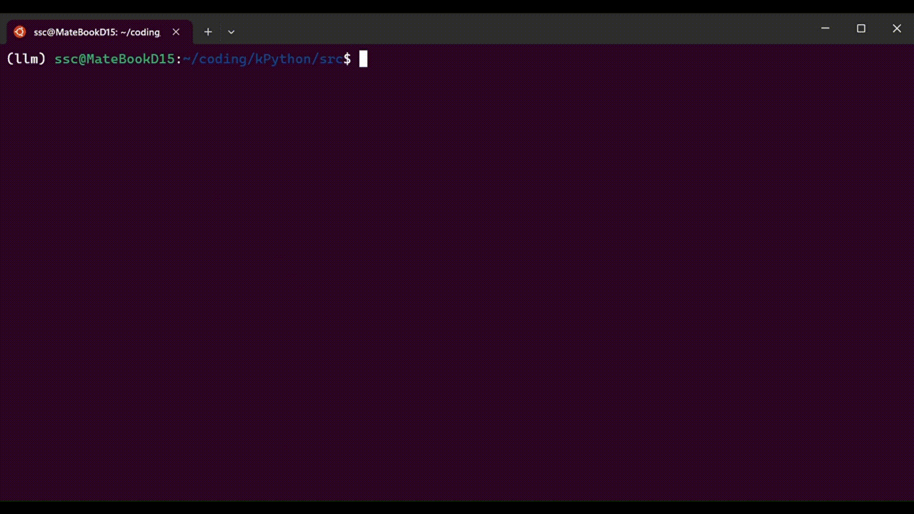
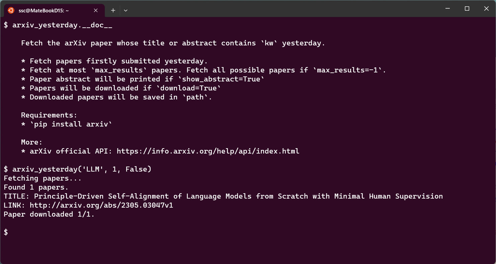

[English](./README_en.md) | [中文简体](./README.zh_CN.md)

# kPython

kPython is a single-line Python command interpreter. Just like iPython, kPython is simply a wrapper of Python. Although it can only process single isolated commands, by writing plugins, kPython can become a powerful Swiss Army knife.

## Usage

1. Clone this repo: `git clone https://github.com/Ki-Seki/kPython.git`
2. Change directory to: `./src/`
3. Run kPython.py: `python kPython.py`

## Featured Plugins

|Name|DEMO|
|--|--|
|chat||
|arxiv_yesterday||

## TODO

- [ ] `kpython_help` show all docs of plugin.
- [ ] Use `rich` library to format all ouputs.